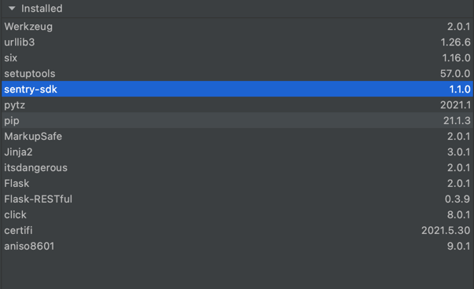
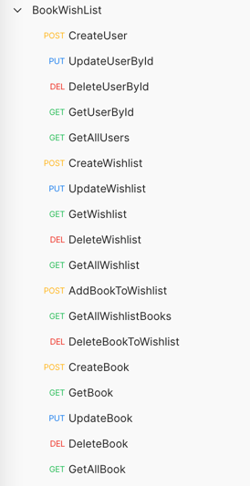

# Design Book WishList Application

## Software Pre-requisites
* Python 2.7.16
* PyCharm IDE

## Database
* SQLite - DB file attached
* Tables and dummy data creates automatically

## Dependencies


## Run Code

````bash
run main.py
````
## Sample CURL
````
curl --location --request GET 'http://127.0.0.1:5000/api/v1/books/all' \
--header 'Content-Type: application/json' \
--data-raw '{
    "title": "Test3",
    "author": "User2",
    "isbn":"12321",
    "dateOfPublication":"July 5th, 2003"
}'
````

## Test Scripts
````
subfolder: TestScripts

Import the attached json file into POSTMAN tool to validate the API

````
